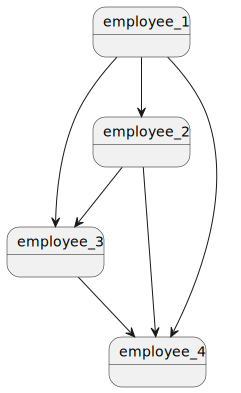
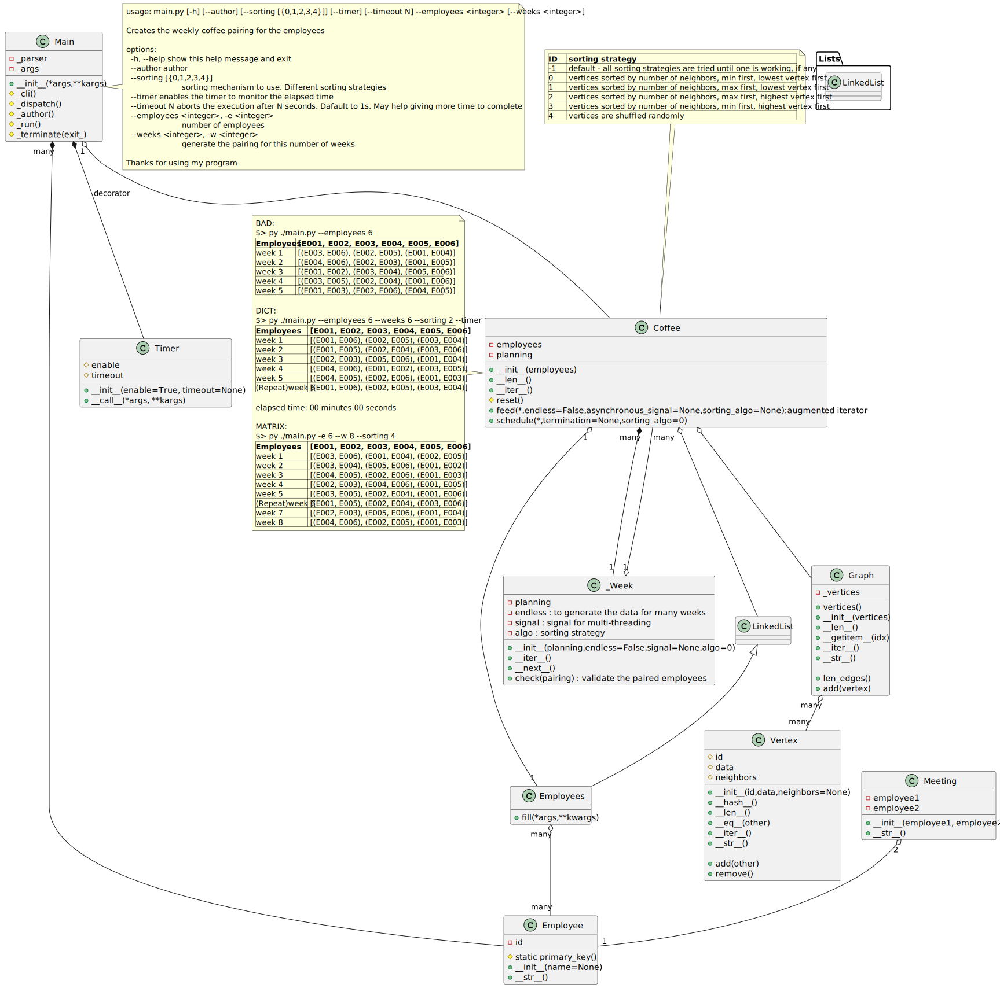

# Pairing employees for 15-minute coffee meeting
## Bertrand Blanc CIST-005B

## Table of Contents

1. [Assignment description](#Assignment_description)
2. [Rough complexity analysis](#Rough_complexity_analysis)
3. [Proposed algorithm](#Proposed_algorithm)
4. [Timing management](#Timing_management)
5. [Technical learning through this project](#Technical_learning_through_this_project)
7. [Program's execution](#Program_s_execution)
8. [UML Class Diagram](#UML_Class_Diagram)
6. [Conclusion](#Conclusion)

## Assignment description 

A manager of a department at Google wants to schedule 15-minute coffee chat between two employees every week for his 6 employees. Design and write a program to help this manager.

* Each employee should have a meeting with a new person. So, no meeting with the same person until they meet all the other colleagues.
* Use functional programming or object-oriented programing. 
You can have your own design to cover the requirements but you should consider a design with better time complexity. 
* You can use any data structures (lists, dictionaries, stacks, queues, ...)
* The number 6 here is an example and imaging there are "n" (an even number) employees in the group (for this example n=6)
* Every week each employee should have a meeting and just one meeting with one person.
* Every week they should have a meeting with a new person. 

## Rough complexity analysis 

Be $n$ the number of employees to be paired up every week.

Every week, $n/2$ unique new pairs are created.

Hence, $n-1$ weeks are needed to have all $n$ employees meeting each other once

* $meeting_k = (employee_i, employee_j)_k, (i,j) \in [0,n[^2, i \neq j, k \in [0,\frac{n^2-n}{2}[$

* $week_k = \{meeting_{t}\}_{t \in [0, \frac{n}{2}[}, k \in [1, n[$

* $\forall i, j \in I_n, i \neq j, week_i \cap week_j = \emptyset$

Thus,

Finding a valid $week_k$ would require exploring the different sequences of $\frac{n}{2}$ employees among the $\frac{n^2-n}{2}$ possible pairs of employees. 

The combination of $r$ elements among a total of $n$ employees is $\binom{n}{r} = \frac{n!}{(n-r)!r!}$

Hence the number of combinations to explore to find the $n-1$ weeks of unique pairs of employees for $\frac{n}{2}$ meetings a week ends up being an exponential problem with a complexity of $O(2^n)$.

Once a set of $n-1$ sequence of $\frac{n}{2}$ meetings is found, verifying that each employee meets only once a week for $n-1$ weeks would require $\frac{n(n+1)}{2} \in O(n^2)$ operations.

In sum, finding a solution to the problem requires an exponential complexity, while verifying such solution could be done in polynomial time. Comsequently, such problem belongs to the class of $NP$-complete problems.

Obviously, some heuristics exist based on the provided constraints to reduce the realm of possibilities.

For example, with $n=10$, the $5$ meetings are drawn from $\binom{45}{5} = 17,593,329,600$ possibilites. Obviously, no decent algorithm can explore so many possibilities in reasonable time. The constraint that an employee can only meet once in a week, helps reducing these possibilities. Such heuristics don't change the non-polynomial nature of this problem.

## Proposed algorithm 

My assumption is that each sequence of $\frac{n}{2}$ meetings satisfying the properties mentioned above is a correct sequence based on the known context from the previous weeks.

If $n-1$ weeks can be found in sequence verifying such constraints, then this sequence is a solution to the problem.

Finding a sequence for a week explores all pairs of employees, hence up to $(n-1)*n^2 \in O(n^3)$ operations with a lot of weeding since we know such pairs shall be unique.

How to find such sequences?

I chose to sort the employees according to the other employees they have to still meet. A graph structure was hence well-suited to capture such topography. 

Example for $n = 4$, we can represent the $\frac{n^2-n}{2} possibilities as a triangular matrix or as a bubble diagram.

|employees|1|2|3|4|
|---|---|---|---|---|
1|N/A|to meet|to meet|to meet|
2|N/A|N/A|to meet|to meet|
3|N/A|N/A|N/A|to meet|
4|N/A|N/A|N/A|N/A|

I sorted the vertices according to 5 different methods:

|method|description|example|
|---|---|---|
0|least neighbors first, smallest ID first | $\{employee_3, employee_2, employee_1\}$
1| most neighbors first, smallest ID first|$\{employee_1, employee_2, employee_3\}$
2 | most neighbors first, highest ID first | $\{employee_1, employee_2, employee_3\}$
3 | least neighbors first, highest ID first | $\{employee_3, employee_2, employee_1\}$
4 | random selection | $\{employee_2, employee_3, employee_1\}$ among $3!$ possibilites 

The strategy is to explore each of these sorting methods until one works. It is possible that none of them would work for two reasons:

1. none of them end up with a valid sequence of $n-1$ $\frac{n}{2}$-meetings
2. the time to explore the sequences takes unreasonable time, hence aborted

In the following example for $n=4$, the second sorting algorith was used (most neighbors first, smallest ID first). After three weeks, all employees have met: no vertex remain in the graph.

## Timing management 

As previously seen, an algorithm (or all) may not terminate timely. To "_give a chance_" to each sorting algorithm, I implemented a timeout using a multi-threading approach. Each algorithm has a certain amount of time to finish, if not, the timeout kils its execution, to move to the next sorting method.

According to the number of nodes to process, it may be reasonable to increase the timeout. For example, up to 32 employees, 1 second is enough to complete. Above 32, no algorithm can finish within 1 second, hence increasing the throttle to a 5-second timeout.

I implemented a basic timeout as follow.

    from threading import Thread, Event
    import time

    def timeout(timer:int, signal:Event) -> None
        time.sleep(timer)
        signal.set()

    def function_to_run(<parameters>, signal:Event, result:List) -> None
        # the code is instrumented in a way that it is sensitive
        # to signal.is_set() to elegantly abort its own execution

        # the result is provided by reference via result[0]

    def arbiter(time_slice):
        signal = Event()
        result = [None]

        timer = Thread(target=timeout, kwargs={'timer':time_slice, 'signal':signal})
        algo = Thread(target=function_to_run, args=(<parameters>), kwargs={'signal':signal, 'result':result}

        algo.start()
        timer.start() 

        timer.join()
        algo.join()

        if result[0] is None:
            # function_to_run execution was killed
        else:
            # function_to_run successfully completed

## Technical learning through this project 

I needed to log the time the different algorithms needed to run to give me an idea about the scale. To do so, I created a class-based decorator with dual purpose: logging the time and/our acting as a timeout to exit the program. I run the wrapped function as a daemon in the background using the [*threading* module](https://docs.python.org/3/library/threading.html): the function doesn't have to be instrumented to elegantly abort iteself. When the allotted time has reached, the main thread returns. I'm skeptical about this method, since the thread is left to die, the usage of a [_Process_ with a _terminate()_ method](https://docs.python.org/3/library/multiprocessing.html) may be more appropriate. See [decorator_timer.py](decorator_timer.py) Python file. A stub for a class-based decorator looks as follow:

    class decorator():
        def __init__(self, *args, **kargs):
            # initialize the instance attributes

        def __call__(self, func):
        # dunder magic method invoked by the decorator

            @functools.wraps(func) # this decorator allows the python help to properly display the arguments 
            def wrapper(*args, **kargs):
                # instrumentation
                result = func(*args, **kargs)
                # more instrumentation
                return result
        return wrapper
 

In order to present a nicely packaged command line interface, I used [the module *argparse*](https://docs.python.org/3/library/argparse.html) in the file (main.py)[main.py] as follow:

        parser = argparse.ArgumentParser(
            prog='main.py',
            description='Creates the weekly coffee pairing for the employees',
            epilog='Thanks for using my program',
        )

        parser.add_argument('--author', help="author", action='store_true')

        parser.add_argument('--sorting', help="sorting mechanism to use. Different sorting strategies", nargs='?', type=int, default=-1, choices=[0,1,2,3,4])

        parser.add_argument('--timer', help="enables the timer to monitor the elapsed time", action='store_true')

        parser.add_argument('--timeout', help="aborts the execution after N seconds. Dafault to 1s. May help giving more time to complete", action='store', type=int, metavar='N', default=1)

        parser.add_argument('--employees', '-e', help="number of employees", action='store', type=int, metavar='<integer>')

        parser.add_argument('--weeks', '-w', help="generate the pairing for this number of weeks", action='store', type=int, metavar='<integer>')

Usually I write documents using MS-Word and various sources of media like images. To write this document, I used *Markdown* (MD) which seems to be a popular documentation-oriented textual format. I was acquainted with this format while using GitHub. The learning curve to use it is quite quick using [basic syntax](https://www.markdownguide.org/basic-syntax/) like title, paragraphs, image insertion, or [more advanced syntax](https://markdownguide.offshoot.io/extended-syntax/) like tables, [plantUML](https://pdf.plantuml.net/1.2020.22/PlantUML_Language_Reference_Guide_en.pdf) inserts or [LaTex](https://quickref.me/latex) for mathematical expressions. Unfortunately, the plantUML and $La^{T}\epsilon \chi$ inserts are not converted by the HTML or PDF extension I used in my Visual Studio IDE.

## Program's execution 

Run the command without argument or with the option -h/--help to get a description of the Command Line Interface (CLI).
For a given number of employees N, the program finds N-1 unique N//2 pairs.

    $> py ./main.py                           
    usage: main.py [-h] [--author] [--sorting [{0,1,2,3,4}]] [--timer] [--timeout N] --employees <integer> [--weeks <integer>]

    Creates the weekly coffee pairing for the employees

    options:
      -h, --help            show this help message and exit
      --author              author
      --sorting [{0,1,2,3,4}]
                            sorting mechanism to use. Different sorting strategies
      --timer               enables the timer to monitor the elapsed time
      --timeout N           aborts the execution after N seconds. Dafault to 1s. May help giving more time to complete
      --employees <integer>, -e <integer>
                        number of employees
      --weeks <integer>, -w <integer>
                        generate the pairing for this number of weeks

    Thanks for using my program

A few examples of outputs follow. More examples can be found in the file [examples.txt](examples.txt)

    $> py ./main.py --employees 6
    Employees: [E001, E002, E003, E004, E005, E006]
    week 1: [(E003, E006), (E002, E005), (E001, E004)]
    week 2: [(E004, E006), (E002, E003), (E001, E005)]
    week 3: [(E001, E002), (E003, E004), (E005, E006)]
    week 4: [(E003, E005), (E002, E004), (E001, E006)]
    week 5: [(E001, E003), (E002, E006), (E004, E005)]

or

    $> py ./main.py --employees 10 --sorting 1
    Employees: [E001, E002, E003, E004, E005, E006, E007, E008, E009, E010]
    week 1: [(E001, E010), (E002, E009), (E003, E008), (E004, E007), (E005, E006)]
    week 2: [(E001, E009), (E002, E010), (E003, E007), (E004, E005), (E006, E008)]
    week 3: [(E001, E005), (E006, E010), (E003, E009), (E007, E008), (E002, E004)]
    week 4: [(E001, E003), (E004, E010), (E005, E008), (E007, E009), (E002, E006)]
    week 5: [(E003, E006), (E008, E009), (E005, E010), (E002, E007), (E001, E004)]
    week 6: [(E001, E002), (E009, E010), (E004, E008), (E003, E005), (E006, E007)]
    week 7: [(E006, E009), (E003, E004), (E008, E010), (E002, E005), (E001, E007)]
    week 8: [(E005, E009), (E004, E006), (E002, E003), (E007, E010), (E001, E008)]
    week 9: [(E001, E006), (E002, E008), (E003, E010), (E004, E009), (E005, E007)]

## UML Class Diagram 

## Conclusion 

To conclude, up to 40 nodes can be processed within reasonable time.

Instead of using threads, I could have used the _multiprocessing_ module to eventually kill the processes using SIGTERM or SIGKILL signals natively implemented via the _Process.terminate()_ or _Process.kill()_ methods. Such approach would prevent having to instrument the code to be sensitive to an external signal to abort itself. However, a SIGKILL signal may have left the data in an unstable state. The threading approach allows to choose when and how to abort self, hence ensuring the data are still consistent.

I'd also like to experiment with other sorting algorithm, eventually running all of them concurrently. Such strategy seems resource consumming. It may be unlikely that my laptop has enough resources to handle such amount of resources (CPU, RAM, threads limit,...).